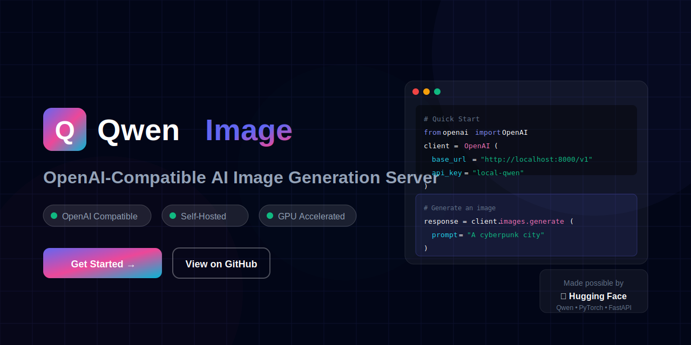

<div align="center">
  
  
  <h1>Qwen Image OpenAI-Compatible Server</h1>
  
  <p><strong>Self-hosted AI image generation with OpenAI-compatible API</strong></p>
  
  <p>
    <a href="#features">Features</a> •
    <a href="#quick-start">Quick Start</a> •
    <a href="#api-reference">API</a> •
    <a href="#playground">Playground</a> •
    <a href="#deployment">Deploy</a> •
    <a href="#credits">Credits</a>
  </p>
  
  <p>
    
    
    
    
    
  </p>
</div>

---

## ✨ What is this?

**Qwen Image Server** is a production-ready, self-hosted image generation server that provides an **OpenAI-compatible API**. It wraps the powerful [Qwen-Image](https://huggingface.co/ovedrive/Qwen-Image-2512-4bit) model through Hugging Face Diffusers, allowing you to:

- 🔌 **Drop-in replacement** for OpenAI's DALL-E API
- 🏠 **Self-host** on your own infrastructure
- 🔒 **Keep data private** - nothing leaves your server
- ⚡ **GPU accelerated** with automatic memory management
- 🎨 **Generate stunning images** from text prompts

## 🚀 Features

| Feature | Description |
|---------|-------------|
| 🔌 **OpenAI Compatible** | Use existing OpenAI SDK code with zero changes |
| 🏠 **Self-Hosted** | Full control over your data and infrastructure |
| ⚡ **Lazy Loading** | Models load on first request, save resources |
| 🔄 **Auto Unload** | Idle VRAM unloading after configurable timeout |
| 🎨 **Multiple Sizes** | OpenAI sizes + native Qwen resolutions |
| 🖼️ **Multiple Formats** | PNG, WebP, JPEG output |
| 🔐 **API Key Auth** | Secure your endpoint with Bearer tokens |
| 📊 **Queue Management** | Configurable concurrency limits |
| 🎯 **Seed Control** | Reproducible results for testing |
| 🚀 **Production Ready** | systemd + nginx configs included |
| 🌐 **Web Playground** | Beautiful UI for testing (included) |

## 📋 Requirements

- **GPU**: NVIDIA GPU with 24GB+ VRAM recommended (RTX 3090/4090)
- **Python**: 3.11+
- **CUDA**: 12.1+
- **RAM**: 32GB+ recommended

<details>
<summary>Lower VRAM Setup</summary>

For GPUs with less VRAM (16GB), enable CPU offloading:

```env
ENABLE_CPU_OFFLOAD=1
MAX_CONCURRENCY=1
```

</details>

## 🏃 Quick Start

### 1️⃣ Clone & Setup

```bash
git clone https://github.com/groxaxo/qwen-image-openai-server.git
cd qwen-image-openai-server
```

### 2️⃣ Create Environment

```bash
# Using conda (recommended)
conda env create -f environment.yml
conda activate qwenimg

# Or using pip
python -m venv venv
source venv/bin/activate
pip install -r requirements.txt
```

### 3️⃣ Configure

```bash
cp .env.example .env
# Edit .env with your preferences
```

### 4️⃣ Run

```bash
./scripts/start_server.sh
```

### 5️⃣ Test

```bash
curl http://127.0.0.1:8000/health
```

## 🎨 Web Playground

The server includes a beautiful web interface for testing image generation:

```bash
# Open in browser
open frontend/index.html
```

Or serve it alongside the API by copying the frontend folder to your static files.

## 📖 API Reference

### Endpoints

| Method | Endpoint | Description |
|--------|----------|-------------|
| `GET` | `/health` | Server health and status |
| `GET` | `/v1/models` | List available models |
| `POST` | `/v1/images/generations` | Generate images from prompts |

### Generate Image

```bash
curl http://127.0.0.1:8000/v1/images/generations \
  -H "Content-Type: application/json" \
  -H "Authorization: Bearer local-qwen" \
  -d '{
    "prompt": "A cyberpunk cityscape at night with neon lights",
    "size": "1024x1024",
    "n": 1,
    "response_format": "b64_json"
  }'
```

### Parameters

| Parameter | Type | Default | Description |
|-----------|------|---------|-------------|
| `prompt` | string | **required** | Text description of the image |
| `size` | string | `1024x1024` | Image dimensions |
| `n` | int | `1` | Number of images (1-4) |
| `response_format` | string | `b64_json` | `b64_json` or `url` |
| `output_format` | string | `png` | `png`, `webp`, `jpeg` |
| `seed` | int | random | For reproducibility |
| `negative_prompt` | string | `""` | What to avoid |
| `num_inference_steps` | int | `20` | Diffusion steps |
| `true_cfg_scale` | float | `4.0` | CFG guidance scale |

### Supported Sizes

**OpenAI-compatible:**
- `1024x1024` → 1328×1328 (square)
- `1024x1536` → 928×1664 (portrait)
- `1536x1024` → 1664×928 (landscape)

**Native Qwen:**
- `1328x1328`, `1664x928`, `928x1664`
- `1472x1104`, `1104x1472`
- `1472x1140`, `1140x1472`
- `1584x1056`, `1056x1584`

## 💻 Code Examples

### Python (OpenAI SDK)

```python
from openai import OpenAI
import base64
from pathlib import Path

client = OpenAI(
    base_url="http://localhost:8000/v1",
    api_key="local-qwen"
)

response = client.images.generate(
    model="qwen-image",
    prompt="A majestic dragon flying over a medieval castle",
    size="1536x1024",
    extra_body={
        "response_format": "b64_json",
        "output_format": "png",
        "seed": 42,
        "negative_prompt": "blurry, low quality",
        "num_inference_steps": 20,
        "true_cfg_scale": 4.0
    }
)

# Save the image
image_data = base64.b64decode(response.data[0].b64_json)
Path("dragon.png").write_bytes(image_data)
print("Saved dragon.png")
```

### JavaScript (fetch)

```javascript
const response = await fetch('http://localhost:8000/v1/images/generations', {
    method: 'POST',
    headers: {
        'Content-Type': 'application/json',
        'Authorization': 'Bearer local-qwen'
    },
    body: JSON.stringify({
        prompt: 'A serene Japanese garden at sunset',
        size: '1024x1024',
        n: 1,
        response_format: 'b64_json'
    })
});

const data = await response.json();
const img = new Image();
img.src = `data:image/png;base64,${data.data[0].b64_json}`;
document.body.appendChild(img);
```

### cURL

```bash
curl http://localhost:8000/v1/images/generations \
  -H "Content-Type: application/json" \
  -H "Authorization: Bearer local-qwen" \
  -d '{
    "prompt": "A futuristic city at night, cyberpunk style",
    "size": "1536x1024",
    "n": 1,
    "response_format": "url",
    "output_format": "png"
  }'
```

## 🚀 Production Deployment

### Systemd

```bash
# Copy files
sudo mkdir -p /opt/qwen-image-openai-server
sudo rsync -av ./ /opt/qwen-image-openai-server/

# Install service
sudo cp deploy/systemd/qwen-image-openai.service /etc/systemd/system/
sudo systemctl daemon-reload
sudo systemctl enable qwen-image-openai
sudo systemctl start qwen-image-openai
```

### Nginx Reverse Proxy

```bash
sudo cp deploy/nginx/qwen-image-openai.conf /etc/nginx/sites-available/
sudo ln -s /etc/nginx/sites-available/qwen-image-openai.conf /etc/nginx/sites-enabled/
sudo nginx -t
sudo systemctl reload nginx
```

### Docker (Optional)

```dockerfile
FROM python:3.11-slim

WORKDIR /app
COPY requirements.txt .
RUN pip install -r requirements.txt

COPY . .

EXPOSE 8000
CMD ["python", "-m", "uvicorn", "app.main:app", "--host", "0.0.0.0", "--port", "8000"]
```

## ⚙️ Configuration

| Variable | Default | Description |
|----------|---------|-------------|
| `MODEL_ID` | `ovedrive/Qwen-Image-2512-4bit` | HuggingFace model ID |
| `API_KEY` | `local-qwen` | API key for auth |
| `HOST` | `127.0.0.1` | Server host |
| `PORT` | `8000` | Server port |
| `LOG_LEVEL` | `INFO` | Logging level |
| `ENABLE_CPU_OFFLOAD` | `0` | Enable for low VRAM |
| `DEFAULT_STEPS` | `20` | Default inference steps |
| `DEFAULT_CFG` | `4.0` | Default CFG scale |
| `MAX_N` | `4` | Max images per request |
| `MAX_CONCURRENCY` | `1` | Concurrent generations |
| `IDLE_UNLOAD_SECONDS` | `900` | Unload after idle |
| `ENABLE_LAZY_LOADING` | `1` | Load model on first request |
| `ALLOW_ORIGINS` | `*` | CORS origins |
| `GENERATED_DIR` | `generated` | Output directory |

## 📊 Performance

| GPU | Time (20 steps) | VRAM |
|-----|-----------------|------|
| RTX 3090 | ~8-12s | ~16GB |
| RTX 4090 | ~5-8s | ~16GB |
| A100 | ~3-5s | ~20GB |

## 🐛 Troubleshooting

<details>
<summary>Common Issues</summary>

### CUDA Out of Memory
```env
ENABLE_CPU_OFFLOAD=1
MAX_CONCURRENCY=1
```

### Model Download Issues
```bash
# Pre-download the model
huggingface-cli login
python -c "from diffusers import DiffusionPipeline; DiffusionPipeline.from_pretrained('ovedrive/Qwen-Image-2512-4bit')"
```

### Port Already in Use
```bash
# Change port in .env
PORT=8001
```

</details>

## 🙏 Credits & Acknowledgments

This project is made possible by the amazing work of:

<table>
  <tr>
    <td align="center">
      <a href="https://huggingface.co/">
        <br>
        <strong>Hugging Face</strong>
      </a>
      <br>Diffusers & Transformers
    </td>
    <td align="center">
      <a href="https://github.com/QwenLM">
        <br>
        <strong>Qwen Team</strong>
      </a>
      <br>Qwen-Image Model
    </td>
    <td align="center">
      <a href="https://pytorch.org/">
        <br>
        <strong>PyTorch</strong>
      </a>
      <br>Deep Learning Framework
    </td>
    <td align="center">
      <a href="https://fastapi.tiangolo.com/">
        <br>
        <strong>FastAPI</strong>
      </a>
      <br>Web Framework
    </td>
  </tr>
</table>

### Special Thanks

- **[ovedrive](https://huggingface.co/ovedrive)** for the Qwen-Image-2512-4bit model
- **Alibaba Qwen Team** for the base Qwen model
- **Hugging Face** for Diffusers library and model hosting
- **FastAPI** team for the excellent web framework

## 📝 License

MIT License - feel free to use this project for any purpose.

## 🤝 Contributing

Contributions are welcome! Please feel free to submit a Pull Request.

1. Fork the repository
2. Create your feature branch (`git checkout -b feature/amazing-feature`)
3. Commit your changes (`git commit -m 'Add amazing feature'`)
4. Push to the branch (`git push origin feature/amazing-feature`)
5. Open a Pull Request

## ⭐ Star History

If you find this project useful, please consider giving it a star ⭐

[](https://star-history.com/#groxaxo/qwen-image-openai-server&Date)

---

<div align="center">
  <p>Made with ❤️ by the open-source community</p>
  <p>
    <a href="https://github.com/groxaxo/qwen-image-openai-server">GitHub</a> •
    <a href="https://huggingface.co/ovedrive/Qwen-Image-2512-4bit">Model</a> •
    <a href="https://github.com/huggingface/diffusers">Diffusers</a>
  </p>
</div>
